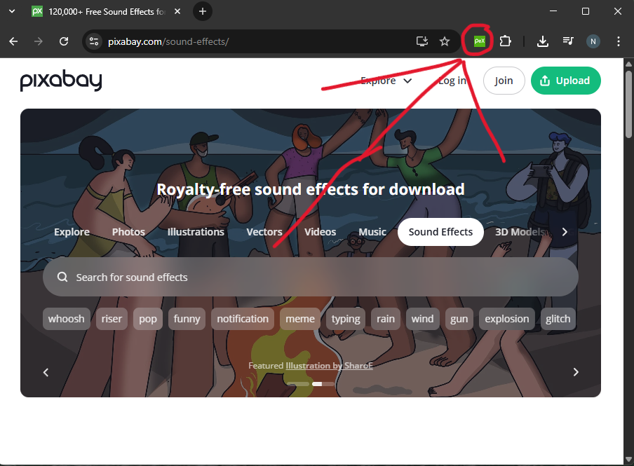
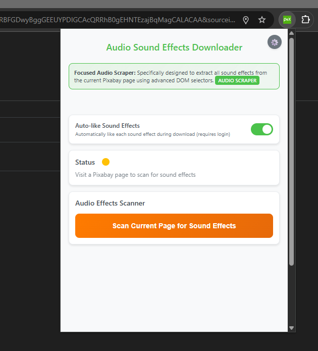
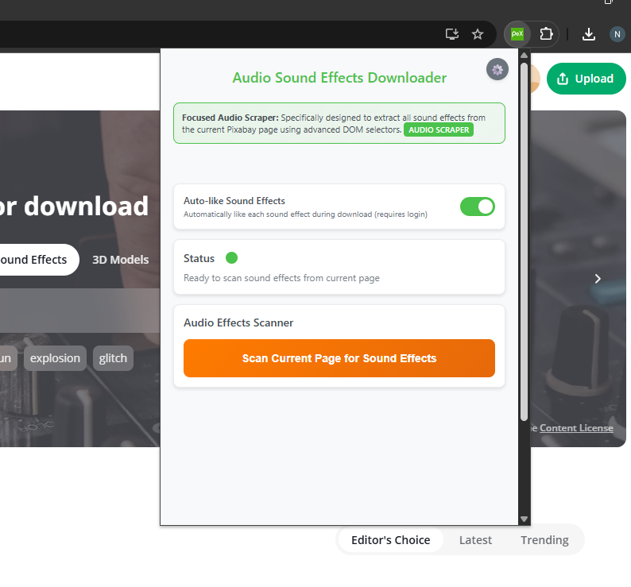
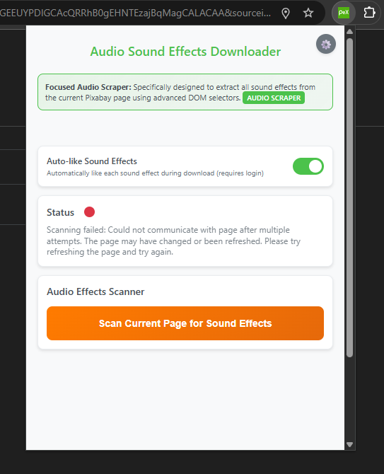
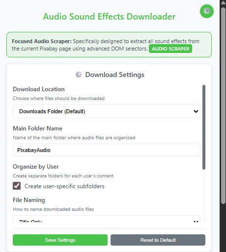
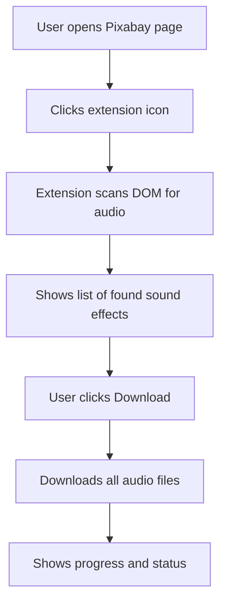

# Pixabay Sound Effects Downloader Chrome Extension

A Chrome extension to extract and download sound effects from Pixabay pages. No API key required!

---

## 📦 Installation

**Manual:**
1. Download or clone this repository
2. Open Chrome and go to `chrome://extensions/`
3. Enable "Developer mode"
4. Click "Load unpacked" and select the project root

**PowerShell (Windows):**
```powershell
.\install-extension.ps1
```

---

## 🚀 Usage Instructions

1. **Go to a Pixabay page** with sound effects (search, user, or category)
2. **Click the extension icon** in your Chrome toolbar
3. **Scan for sound effects** using the scan button
4. **Review and download** the found audio files

---

## 🖼️ Screenshots

### Usage Flow (GIF)


### Key UI States

| Extension Location | Status: Standby | Status: Ready | Status: Error |
|:------------------:|:---------------:|:-------------:|:-------------:|
|  |  |  |  |

| Settings Panel |
|:-------------:|
|  |

---

## 🛠️ How It Works

1. **DOM Scraping:** Uses advanced CSS selectors to find all sound effect entries on the current Pixabay page.
2. **User Detection:** Shows user info if on a profile page.
3. **Scan & Download:** Scans for audio, then downloads all found files with organized naming.
4. **Progress Tracking:** Real-time status, progress bar, and controls for pause/resume/cancel.

---

## 🧩 Extension Workflow (Mermaid Diagram)



---

## 🎨 Design & Features

- **Pixabay Green Theme** (`#4bc24b`)
- Clean, modern popup UI
- Real-time feedback and progress
- Organized downloads and user folders
- No API key required

---

## ⚙️ Technical Details

**Selectors Example:**
```js
const audioRows = document.querySelectorAll('.audioRow--nAm4Z');
const titleElements = audioRow.querySelector('.nameAndTitle--KcBAZ');
```

- Uses Chrome Downloads API
- Safe, sanitized filenames
- Handles user profiles and categories

---

## 📂 Screenshots Folder

Please upload your screenshots to the `screenshots/` folder using the exact filenames above for best README rendering.

## File Structure

```
Pixabay Sound Effects Downloader/
??? manifest.json                 # Extension configuration
??? content-script.js            # DOM scanning logic
??? content-styles.css           # Pixabay green styling
??? background.js                # Download management
??? popup.html                   # Extension interface
??? popup.js                     # UI functionality
??? icon.svg                     # Pixabay green "PeX" icon
??? EXTENSION_README.md          # This documentation
```

## Supported Audio Formats

- **Primary Format**: MP3 (most common)
- **Alternative Formats**: WAV, OGG, AAC, M4A, FLAC
- **Quality**: Depends on source file quality on Pixabay
- **File Sizes**: Varies by audio length and quality

## Performance Features

### Efficient Scanning
- **Smart Scrolling**: Loads all content progressively
- **Duplicate Detection**: Avoids processing same items multiple times
- **Rate Limiting**: Respectful delays between operations
- **Memory Management**: Efficient handling of large audio collections

### Download Optimization
- **Parallel Processing**: Multiple downloads when possible
- **Error Resilience**: Continues downloading even if some files fail
- **Retry Logic**: Attempts to re-download failed items
- **Progress Persistence**: Maintains progress state during pauses

## Troubleshooting

### Extension Not Working
- **Check Extension**: Ensure it's enabled in `chrome://extensions/`
- **Reload Page**: Refresh the Pixabay page after installing
- **Check Permissions**: Verify the extension has access to Pixabay
- **Developer Mode**: Ensure developer mode is enabled for unpacked extensions

### No Sound Effects Found
- **Page Content**: Ensure the page actually contains audio content
- **Scroll Down**: Some content loads dynamically as you scroll
- **Try Different Pages**: Test on known sound effects pages
- **Check Console**: Open Chrome DevTools for detailed error messages

### Download Issues
- **Storage Space**: Ensure sufficient disk space for downloads
- **Internet Connection**: Verify stable internet connectivity
- **Download Permissions**: Check Chrome's download settings
- **Antivirus Software**: Some security software may block downloads

### Performance Issues
- **Large Collections**: Use pause/resume for very large collections
- **Browser Resources**: Close unnecessary tabs during large downloads
- **Network Speed**: Slower connections may require patience
- **Page Complexity**: Complex pages may take longer to scan

## Privacy & Security

### Data Protection
- **No Data Collection**: Extension doesn't collect personal information
- **Local Processing**: All operations performed locally in your browser
- **No External Servers**: Direct communication with Pixabay only
- **Secure Storage**: Uses Chrome's secure storage APIs

### Permissions Explained
- **activeTab**: Access to current Pixabay tab for content extraction
- **downloads**: Ability to save sound effects to your computer
- **storage**: Temporary storage for extension settings
- **scripting**: Inject scripts to analyze Pixabay page content

## Advanced Usage Tips

### Batch Processing
1. **Open Multiple Tabs**: Process different Pixabay pages simultaneously
2. **Use Bookmarks**: Save frequently accessed sound effect pages
3. **Organize Downloads**: Create subfolders for different audio categories
4. **Regular Cleanup**: Periodically organize your downloaded sound effects

### Quality Optimization
1. **Check Source Quality**: Higher quality sources = better downloads
2. **Verify File Integrity**: Test downloaded audio files before use
3. **Format Preferences**: MP3 offers best compatibility across devices
4. **Backup Important Files**: Keep copies of frequently used sound effects

## Development

### Prerequisites
- .NET 8 SDK
- Chrome Browser (latest version)
- Code editor (VS Code, Visual Studio)

### Local Development
```bash
# Clone the repository
git clone <repository-url>

# Navigate to project directory
cd Pixabay-Mass-Audio-Downloader

# Load extension in Chrome
# 1. Open chrome://extensions/
# 2. Enable Developer mode
# 3. Click "Load unpacked"
# 4. Select project root directory
```

### Testing
1. **Test on Different Pages**: Various Pixabay sound effect pages
2. **Check All Browsers**: Primarily Chrome, but test Chromium-based browsers
3. **Verify Downloads**: Ensure audio files play correctly after download
4. **Performance Testing**: Test with large collections of sound effects

## License

This project is licensed under the MIT License - see the LICENSE file for details.

## Disclaimer

This tool is for personal use only. Please:
- **Respect Pixabay's Terms**: Follow all Pixabay terms of service
- **Honor Creator Rights**: Respect the rights of audio creators
- **Check Licenses**: Verify license terms for each downloaded sound effect
- **Use Responsibly**: Don't overload Pixabay's servers with excessive requests

## Support

If you encounter issues:

1. **Documentation**: Review this README thoroughly
2. **Console Logs**: Check Chrome DevTools console for errors
3. **Refresh Extension**: Reload the extension in Chrome
4. **Report Issues**: Create detailed bug reports with screenshots
5. **Feature Requests**: Suggest improvements via issues

## Contributing

Contributions welcome! Please:
1. Fork the repository
2. Create a feature branch
3. Follow the existing code style
4. Test thoroughly on multiple Pixabay pages
5. Submit a pull request with clear description

---

**Happy sound hunting on Pixabay!**